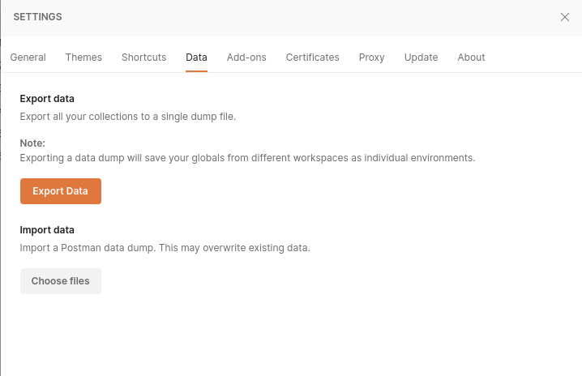
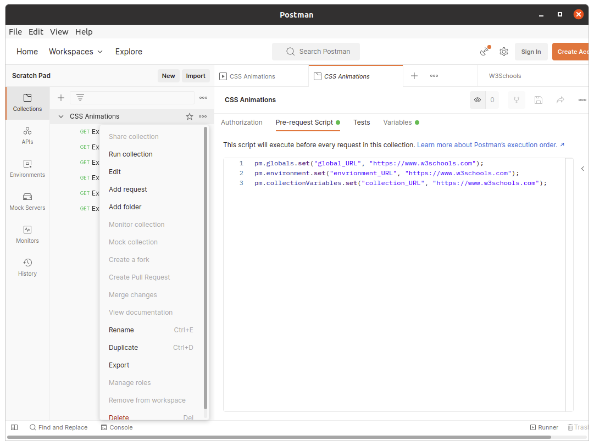
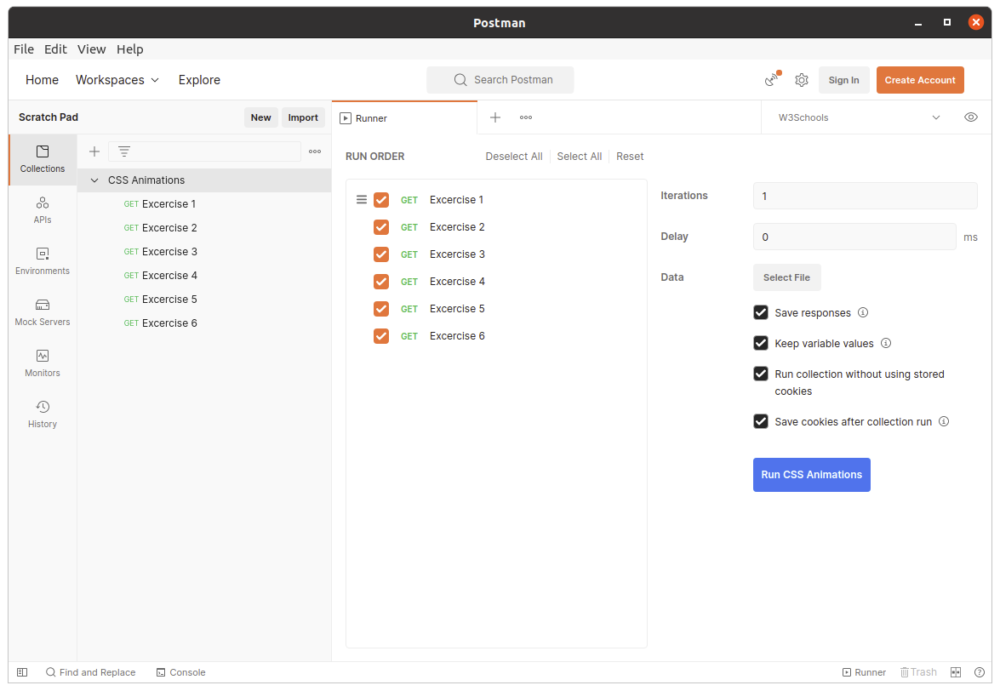
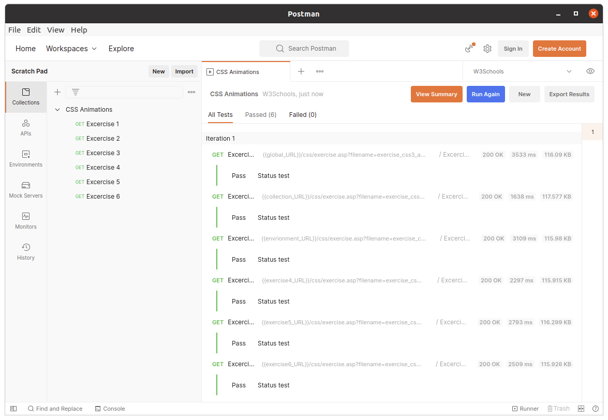
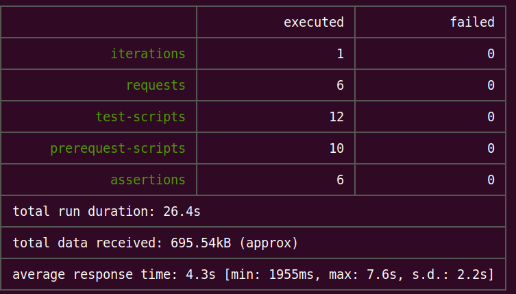

# Postman Install
- unpack: tar -xvf postman-9.23.3-linux-x64.tar.gz

# Newman CLI Install 
npm install -g newman

# Open Postman
-  cd Postman
- ./Postman 
- Import Postman Collection
    - File:Settings:Data
    - Import CSS.Animations.postman_collection.json
      
      
# Run Postman Collection
- Open '...' menu on the CSS Animations collection and select 'Run Collection'

 -Select Options and click "Run CSS Animations" 

- Click View Summary after test run

  
# Run Newman CLI on Postman Collection
- newman run CSS.Animations.postman_collection.json
- View the results output on the command line

# Environment
- npm version 7.10.0
- node version v14.16.0